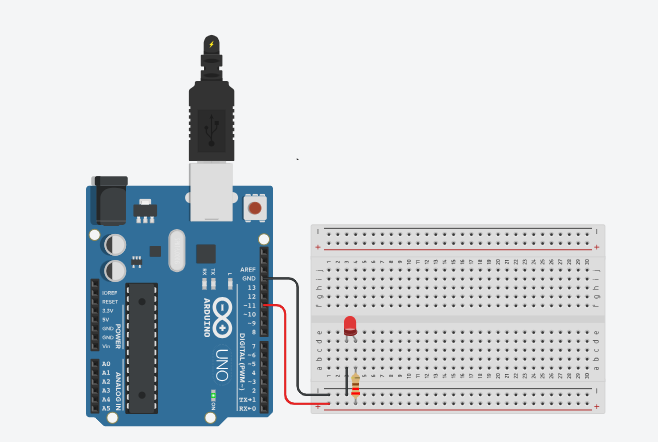

# Aumentando o brilho do LED
 Este experimento consiste em fazer com que o LED conectado na porta digital 11 (PMW) aumente gradativamente o brilho no intervalo de 0 a 255 em passo 5. 

  <b><a href="https://www.tinkercad.com/things/2ABIanyIigy">Clique Aqui</a></b> para ver o projeto em Tinkercard.com!
  
## Lista de componentes:

- 1  Arduíno UNO R3
- 1  Um cabo de conexão USB
- 1  Placa de prototipação (Protoboard)
- 1  LED 
- 1  Resistor de 220 Ω ohms
- 3  Jumpers (macho-macho)

## Esquema do projeto

